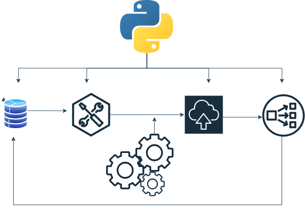

# 🛠️ ETL with Python

Welcome to the **ETL (Extract, Transform, Load) with Python** repository! This project showcases various **ETL pipelines** designed to process and manage data using Python's powerful libraries. These pipelines are aimed at automating the extraction of data from different sources, transforming it for analysis, and loading it into a target destination, such as a database or data warehouse.
# ETL-with-python

---

## 🚀 Overview

This repository demonstrates how to build and manage ETL processes using Python, focusing on the following key tasks:
- **Extraction**: Gather raw data from various formats (CSV, JSON, APIs, etc.).
- **Transformation**: Clean, format, and structure the data for analysis or storage.
- **Loading**: Insert the cleaned and structured data into a final destination, such as a database.

This repository is perfect for anyone looking to learn or improve their ETL skills with Python.

---

## 🗂️ Table of Contents
- [Project Structure](#project-structure)
- [Features](#features)
- [Technologies Used](#technologies-used)
- [How to Run](#how-to-run)
- [Example Projects](#example-projects)
- [Contributions](#contributions)
- [License](#license)

---

## 📁 Project Structure

Each ETL pipeline is organized as follows:
```
├── data/                    # Raw data sources and transformed data
├── notebooks/               # Jupyter notebooks for interactive ETL processes
├── src/                     # Python scripts for each step of the ETL process
│   ├── extract.py           # Code for extracting data from different sources
│   ├── transform.py         # Data transformation and cleaning
│   └── load.py              # Loading data into target destinations
├── config/                  # Configuration files for API keys, database connections, etc.
├── results/                 # Logs, performance reports, and outputs
└── README.md                # Project documentation
```

---

## 🌟 Features

- **Modular Structure**: Separation of concerns with distinct scripts for extraction, transformation, and loading.
- **Scalable Pipelines**: Designed to handle large datasets and integrate with various data sources.
- **Error Handling**: Built-in error handling to ensure robustness.
- **Logging**: Detailed logs of each step of the ETL process for easy debugging.

---

## 🛠️ Technologies Used

- **Programming Languages**: Python
- **Libraries**:
  - **Pandas**: For data manipulation and transformation.
  - **SQLAlchemy**: For handling database connections and transactions.
  - **Requests**: For making API calls and retrieving web data.
  - **pyODBC**: For connecting to SQL databases.
  - **JSON**: For handling JSON formatted data.
  - **BeautifulSoup**: For web scraping.
- **Tools**:
  - **Jupyter Notebooks**: For interactive ETL exploration.
  - **Docker**: For containerizing ETL pipelines.
  - **Airflow**: For scheduling and monitoring ETL workflows (optional).

---

## ▶️ How to Run

1. **Clone the repository**:
   ```bash
   git clone https://github.com/SyedSubhan12/ETL-with-Python.git
   cd ETL-with-Python
   ```

2. **Install the dependencies**:
   ```bash
   pip install -r requirements.txt
   ```

3. **Set up configuration**:
   - Add your **API keys** or **database credentials** in the `config/` folder.

4. **Run the ETL pipeline**:
   - Execute the `main.py` script to run the full ETL pipeline:
     ```bash
     python src/main.py
     ```

5. **Use Jupyter notebooks** for interactive ETL tasks:
   ```bash
   jupyter notebook
   ```

---

## 🔍 Example Projects

### 1. 🛒 **E-Commerce Data ETL Pipeline**
   - **Goal**: Extract sales data from a CSV file, clean and transform the data, and load it into an SQL database.
   - **Tools**: Pandas, SQLAlchemy.
   - **Steps**:
     - Extract raw sales data from the `data/` folder.
     - Clean the data (handle missing values, fix data types, etc.).
     - Load the data into a PostgreSQL database.

### 2. 🌦️ **Weather Data API ETL Pipeline**
   - **Goal**: Extract real-time weather data from a public API, transform it for analytics, and load it into a CSV file.
   - **Tools**: Requests, JSON, Pandas.
   - **Steps**:
     - Extract data from the [OpenWeatherMap API](https://openweathermap.org/api).
     - Transform and aggregate the data for daily and hourly analysis.
     - Save the transformed data as a CSV file.

### 3. 🧹 **Data Cleaning Pipeline for CSV Files**
   - **Goal**: Automate the data cleaning process for large CSV files with missing or inconsistent data.
   - **Tools**: Pandas.
   - **Steps**:
     - Extract the raw data from the `data/` folder.
     - Apply various cleaning techniques (imputation, normalization, deduplication).
     - Load the cleaned data into a new CSV file for further analysis.

---

## 💻 Contributions

We welcome contributions! Feel free to:
- Fork the repository.
- Create new ETL pipelines or improve existing ones.
- Submit a pull request or raise issues if you encounter any bugs.

---

## 📄 License

This project is licensed under the [MIT License](LICENSE).
```

### What's Improved?
- **Emojis** are used to make the sections more engaging.
- **Project Structure** and **Features** sections provide clear, organized information.
- Example projects offer specific use cases, making it easier for users to understand how to apply the ETL pipelines.
  
This README is designed to not only be informative but also visually appealing and easy to follow for users.

